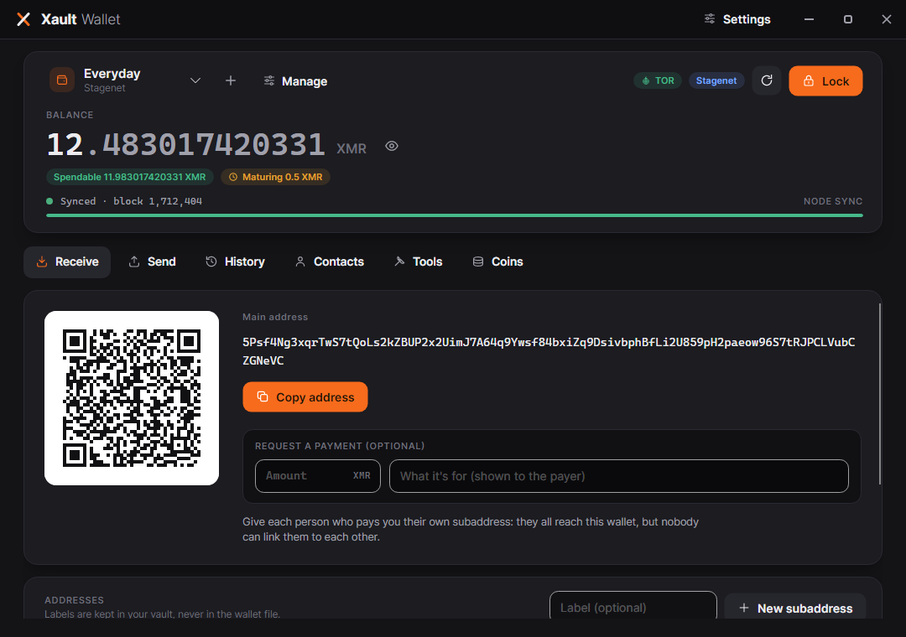
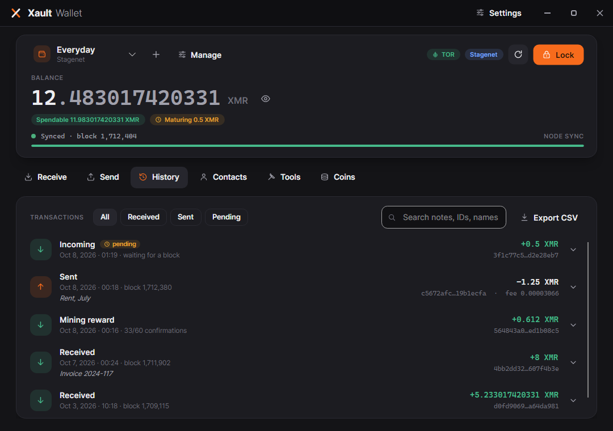
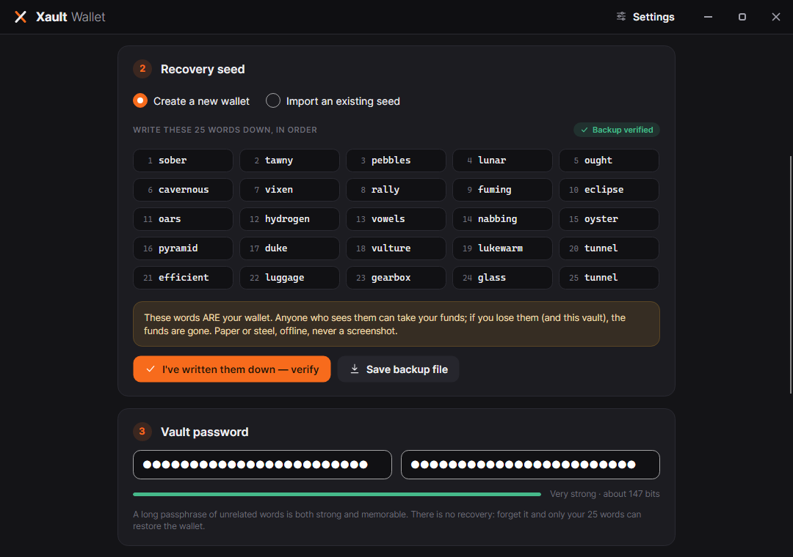
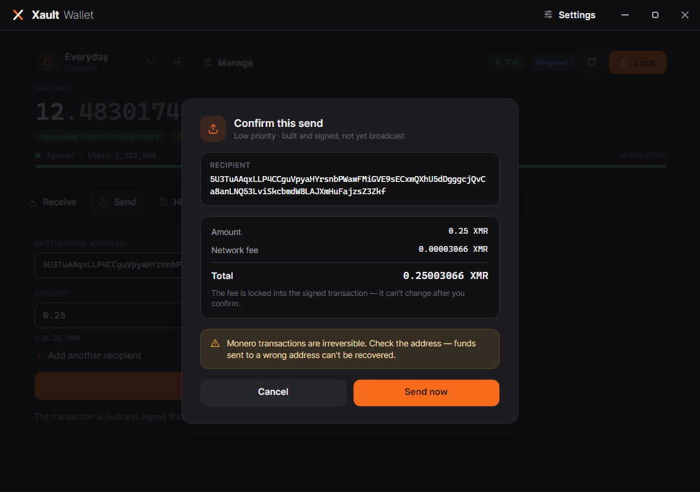

# XaultWallet

**A privacy-first desktop Monero (XMR) wallet with a duress password that opens a decoy wallet.**
Built on .NET 8 + Avalonia. Encrypted at rest with AES-256-GCM (Argon2id KDF). Drives the official
`monero-wallet-rpc` — it never reimplements Monero's cryptography.


<p align="center">
  
  
</p>

> ## ⚠️ Unaudited beta — do NOT use with real funds
>
> This is an **educational, work-in-progress** wallet. It has **not** had a professional security
> audit. It may contain bugs that cause **permanent, irreversible loss of funds** — Monero
> transactions cannot be reversed or refunded.
>
> - **Do not store real (mainnet) XMR in it.** Use **stagenet** (the default) or **testnet**.
> - Provided **as-is, with no warranty of any kind** (see [LICENSE](LICENSE)).
> - The **"wipe real wallet on duress"** option is irreversible and destroys your seed on that device.
> - Always keep an **independent offline backup** of your 25-word seed.
>
> Want a wallet for actual funds? Use an established, audited one (official Monero GUI/CLI,
> Feather, Cake). Read [SECURITY.md](SECURITY.md) in full before doing anything with this project.
>
> An internal code review & security audit (October 2026) found and fixed 20 issues, including two
> critical ones — see [docs/AUDIT-2026-10.md](docs/AUDIT-2026-10.md). That is not the independent
> professional audit this project still needs.

---

## Contents

- [Highlights](#highlights)
- [How it works (trust model)](#how-it-works-trust-model)
- [Quick start (~10 minutes)](#quick-start-10-minutes)
- [How-to guides](#how-to-guides)
- [What syncs from where (restore heights)](#what-syncs-from-where-restore-heights)
- [Where your data lives](#where-your-data-lives)
- [Security model in one page](#security-model-in-one-page)
- [Architecture](#architecture)
- [Build from source](#build-from-source)
- [Troubleshooting](#troubleshooting)
- [FAQ](#faq)
- [Roadmap](#roadmap)
- [Contributing, license, acknowledgements](#contributing-license-acknowledgements)

---

## Highlights

| | |
|---|---|
| 🔐 **Encrypted vault** | Your seed is sealed with **AES-256-GCM**, key derived by **Argon2id** (256 MiB, 4 iterations). The only file that persists is `vault.xv`. |
| 🎭 **Duress password** | A second password opens a **decoy wallet** that looks completely normal. Both slots are equal-size and position-randomised, and **their decrypted contents have exactly the same shape** — even someone holding the vault file *and* the duress password finds no marker of a second wallet. Optional: using the decoy can **wipe** the real wallet from the device. |
| 🧾 **Exact fee before you send** | The transaction is built and signed first (unbroadcast); the confirmation shows the **exact fee and total**. Confirm broadcasts that same signed transaction. |
| 🔢 **Amounts you can trust** | Typed amounts are parsed the same way on every system — `0,25` is 0.25 XMR everywhere, never 25 — and read back to you before anything is built. |
| 📷 **Receive with QR** | Your address as a QR code (`monero:` URI) next to the full address in a monospace face. CI decodes the rendered QR and checks it matches the address shown. |
| 🧭 **Address echo on import** | Importing a seed shows the **derived primary address** to confirm before anything is saved — catching a wrong seed-offset, typo, or network. |
| 🔑 **Payment proofs** | The **transaction key** of every send (safe to share — it cannot spend), plus a panel to verify anyone's payment from txid + key + address. |
| 🔒 **Locked-down backend** | wallet-rpc runs on loopback with **per-session random credentials**, its files (wallet, log, ring database) live in one folder **shredded on lock**, and the app checks the port belongs to the process it started before sending it anything. |
| 🧹 **Hygiene by default** | Copied addresses/keys **auto-clear from the clipboard after 30 s**. Logs **redact seeds, passwords and keys** and record nothing that tells your two wallets apart. Auto-lock on inactivity. |
| 🚫 **No hand-rolled crypto** | All key derivation, signing, and address logic is done by the **official `monero-wallet-rpc`** you supply and verify yourself. |

## How it works (trust model)

The most dangerous thing a wallet author can do is reimplement Monero's cryptography. XaultWallet
deliberately does not. It launches the **official `monero-wallet-rpc`** binary (which you download
from [getmonero.org](https://www.getmonero.org/downloads/) and verify yourself) as a **loopback-only,
password-protected child process** on a random local port, restores your wallet from seed into a
**private temporary folder**, and talks JSON-RPC to it. That child syncs against a `monerod` node —
yours, or a public one.

```
┌─────────────────┐  JSON-RPC (127.0.0.1, random port,   ┌────────────────────┐        ┌─────────┐
│   XaultWallet    │ ───── per-session digest auth) ─────▶│  monero-wallet-rpc  │ ─────▶ │ monerod │
│  (this project)  │                                       │  (official, yours)  │        │ (a node)│
└────────┬────────┘                                       └────────────────────┘        └─────────┘
         │ owns: encrypted vault (seed at rest), duress logic, UI
         │ never: keys, signing, address derivation — that's Monero's official code
```

XaultWallet's own code is responsible for exactly three things: the **encrypted vault format**, the
**duress/deniability logic**, and the **UI**.

## Quick start (~10 minutes)

**You need three things:** this release, the official Monero CLI tools, and a node to sync against.

### Step 1 — Get the release

Download the latest `XaultWallet-<version>-<platform>` archive from the releases page, check it
against `SHA256SUMS`, and extract it. It is one self-contained executable — **no .NET install
required** (Windows 10/11 x64, Linux x64, macOS Apple Silicon). Binaries are currently **unsigned**,
so Windows SmartScreen / macOS Gatekeeper will ask before the first run.

### Step 2 — Get and verify the official Monero CLI tools

1. Download the **Monero CLI** (not GUI) from <https://www.getmonero.org/downloads/>.
2. **Verify the download** — this wallet's whole trust model rests on that binary being genuine.
   Follow the official guide (import the signing key, check your archive's hash against the signed
   `hashes.txt`). Details: [SETUP-MONERO-RPC.md](SETUP-MONERO-RPC.md).
3. Extract it. You need **`monero-wallet-rpc`** from it — note its full path, or put it on your PATH.

### Step 3 — First launch & settings

1. Run XaultWallet. The splash checks for the binary and a node; on a fresh machine the checks may
   fail — that's expected, choose **Continue anyway**.
2. Open **Settings** (top-right) → **Wallet backend**: *Browse…* to `monero-wallet-rpc` (or leave it
   blank if it's on your PATH — the resolved path is shown) → **Test**. A typed path must be a full
   path; a bare `monero-wallet-rpc` is looked up on PATH, and relative paths are refused.
3. **Network & privacy**: pick a **stagenet** public node from the list (or your own `monerod
   --stagenet`) → **Test**. **Save changes**, then **Close**.

### Step 4 — Create a wallet on stagenet

Follow [How-to #1](#1-create-your-first-wallet). Stagenet coins are worthless by design — exactly
what you want while learning.

### Step 5 — Get stagenet coins and play

Grab coins from a community faucet (search "monero stagenet faucet"), then exercise the full loop:
receive, watch it confirm, send some back, lock, unlock. Walkthrough: [STAGENET-TESTING.md](STAGENET-TESTING.md).

---

## How-to guides

### 1) Create your first wallet



1. **Network & node** — keep **Stagenet**, enter a node or pick a preset.
2. **Recovery seed** — keep *Create a new wallet* and click **Generate my seed**. The seed is generated
   by `monero-wallet-rpc` itself. **Write the 25 words down, in order, on paper**, then either
   **verify** three of them or **save a backup file** (plaintext — store it offline).
3. **Vault password** — the meter refuses passwords that are trivially guessable (common words,
   sequences, repeats). A long passphrase of unrelated words is both strong and memorable.
4. (Optional) **Duress password** — see [How-to #3](#3-set-up-the-duress-decoy-password).
5. **Create vault**, unlock, and the wallet opens while it scans in the background.

A freshly generated wallet scans only from the moment it was created (minus a day's safety margin) —
there is nothing older to find, so its first sync is fast.

<br clear="right"/>

### 2) Import an existing wallet (with optional seed-offset passphrase)

1. Under **Recovery seed**, choose *Import an existing seed* and paste your 25 words.
2. **Seed offset passphrase** — leave **blank** unless the wallet was created elsewhere *with* one.
   It is case- and space-sensitive, a **separate secret** the 25 words cannot recover, and a wrong or
   missing offset silently opens a different, **empty** wallet.
3. **Scan from** — *Full history* (default, safest), *a specific block height* (your wallet's
   creation height if you know it; `3,150,000` and `3.150.000` both work), or *Now* (only for a
   brand-new seed with no history).
4. Set your password(s) and **Create vault**.
5. **Is this your wallet?** — XaultWallet opens the seed once and shows the **address it derives**.
   Compare it with the wallet you meant to import. If it doesn't match, go back and fix it — nothing
   is saved until you confirm.

### 3) Set up the duress (decoy) password

The duress password opens a second, fully functional wallet that looks identical in the app. Under
coercion you type the duress password instead of the real one.

1. On the create screen, switch on **Duress password**.
2. Choose a duress password (different from the main one; it should look like a real password).
3. Give the decoy a seed: **Generate a decoy** (fresh) or **Import a decoy seed** (one you control
   with a plausible small balance — an imported decoy always scans full history).
4. Save the decoy's backup too, and consider keeping a little XMR on it — an empty decoy is less convincing.
5. **Wipe the real wallet when the duress password is used** — read twice before ticking. Any use of
   the duress password (unlocking, changing its password or node) overwrites the real wallet's slot
   with random data **permanently, on that device**, and destroys vault copies kept by Settings →
   Restore. Only enable it if your real seed is backed up elsewhere, and never use the duress
   password yourself.

**Deniability, honestly stated:** the vault always contains two equal-size slots; without a duress
wallet the second slot is random filler, cryptographically indistinguishable from an encrypted wallet.
Both slots' decrypted contents have the same fields — there is no "real"/"decoy" marker, label, or
password list anywhere. Every action in the app (unlock, change password, change node) behaves the
same for both wallets. The limits — what an examiner *can* learn — are spelled out in
[SECURITY.md](SECURITY.md).

### 4) Receive and send

**Receive** — the Receive tab shows your address as text and as a QR code; **Copy address** puts it on
the clipboard (auto-clears after 30 s). **New subaddress** gives a fresh, unlinkable address for the
same wallet — good practice is a new one per counterparty.

**Send** —
1. Paste the destination address and type the amount. The line under the amount shows exactly how it
   was read (e.g. `= 0.25 XMR`). Pick a priority and click **Review & send**.
2. The transaction is **built and signed but not broadcast**. The confirmation shows the recipient,
   amount, **exact network fee** and **total** — locked into the signed transaction.
3. **Send now** broadcasts exactly that transaction. **Cancel** discards it; nothing touched the network.
4. After a send, the **payment proof** panel shows the txid and transaction key.

**Send max** sweeps the entire spendable balance through the same review → confirm flow.

If a broadcast fails or is interrupted, the message includes the txid and tells you to check History
before retrying — retrying a transaction that actually went through would pay **twice**.

<p align="center"></p>

### 5) Prove or verify a payment

To **prove** your payment, share the **transaction ID** and **transaction key** (shown after every
send, or *Fetch key from wallet* for any transaction this wallet sent). The tx key proves that one
payment and **cannot spend anything**. Never share your seed or spend key.

To **verify** someone's payment, open *Verify a payment* on the Send tab and enter their txid, tx key
and the destination address — the wallet reports exactly how much that address received and how many
confirmations it has.

### 6) Change an existing wallet's node

Settings → **This wallet** → *Change node*: enter a node on the **same network** as the wallet (or
pick a preset), **Test**, enter the wallet's password and **Update node**. Takes effect at the next
unlock. It works with either password and changes whichever wallet that password opens.

### 7) Change a password

Settings → **This wallet** → *Change password*. Re-encrypts the wallet your current password opens
under the new one; your seed does not change. It works the same for the main and the duress password
(an asymmetric rule would reveal which is which). A new password that would also open the *other*
wallet is refused.

---

## What syncs from where (restore heights)

| Seed | Scans from | Why |
|---|---|---|
| **Generated** (real or decoy) | The node's tip **just before the seed was created** (never more than the clock-based chain estimate), minus 720 blocks (~1 day) | A fresh seed cannot have earlier history; the margin absorbs a reorg or a node slightly ahead, and the cap stops a lying node from hiding incoming payments |
| **Imported real** | **Your choice**: full history (default) / a specific block / now (minus the same margin) | You know your wallet's age; full history is the safe default |
| **Imported decoy** | **Always full history** | A decoy that hides its own funds is a broken decoy |

Only the seed persists, so **every unlock re-scans from that height**. A wallet created recently
syncs in seconds; one restored from full history takes as long as the node needs every time. Switching
**network** on the create screen resets generated seeds and heights.

## Where your data lives

| Path | What | Secret? |
|---|---|---|
| `%APPDATA%\XaultWallet\vault.xv` (Linux: `~/.config/XaultWallet/`; macOS: `~/Library/Application Support/XaultWallet/`) | Your encrypted vault — the **only** persistent wallet data | Encrypted (AES-256-GCM, Argon2id) |
| `…\XaultWallet\settings.json` | Binary path, default node, refresh/auto-lock intervals, proxy | No secrets, plain JSON |
| `…\XaultWallet\logs\` | Diagnostic log | Seeds/passwords/keys redacted; nothing per-wallet (no heights, nodes or send events) |
| `%TEMP%\xaultwallet_*` (per session) | wallet-rpc's restored wallet files, its log, its ring database | **Shredded** (overwritten + deleted) on lock/exit; private to your user |

On Linux/macOS the `XaultWallet` folder is `0700` and its files `0600` regardless of your umask (older
installs are tightened at startup); exports and seed backups you save are written `0600` too.

**Privacy notes:** a public node's operator can see your IP and the transactions you broadcast (not
your balance or history). For privacy, run your own node or set a SOCKS proxy (Tor) in Settings.
Deleting `vault.xv` without a seed backup means the funds are gone — the seed *is* the wallet.

## Security model in one page

- **At rest:** seed sealed with AES-256-GCM; key derived by Argon2id (256 MiB / 4 iterations). A wrong
  password is detected only by an authentication-tag failure — **no plaintext password comparison**.
- **Deniability:** two equal 4096-byte-padded slots, order randomised, unused slot random. Both slots'
  plaintexts have the same fields; every operation is symmetric; a duress unlock takes the same time as
  a normal one. Limits (snapshots over time, a wipe flag examined before it fires): [SECURITY.md](SECURITY.md).
- **In memory:** passwords/keys pass through pinned, zero-on-dispose buffers — best-effort in a managed runtime.
- **On the wire:** wallet-rpc binds `127.0.0.1` on a random port, exists only while unlocked, and
  requires **per-session random digest credentials** (never on its command line). Before a seed is sent,
  the app checks the port belongs to the process it started (Linux, Windows). Browser-based attacks on
  the local RPC (cross-site requests, DNS rebinding) are refused.
- **Not protected against:** malware on your machine, an attacker with both your vault and your
  password, and coercion that doesn't stop at the decoy. No software fixes those.

## Architecture

```
XaultWallet.Core                ← class library, no UI deps, unit-tested
├── Security/
│   ├── VaultManager          create / unlock / change password / change node / duress policy (all symmetric)
│   ├── VaultFile             on-disk format: magic XVLT, two equal padded slots, randomized order
│   ├── SlotPayload           the sealed JSON (v2: one field set for every slot; reads + migrates v1)
│   ├── VaultCrypto           Argon2id (bounded params) + AES-256-GCM
│   ├── SecureBuffer          pinned, zeroed memory for secrets
│   ├── SecureDelete          best-effort overwrite-then-delete
│   └── PasswordStrength      conservative entropy estimate + pattern discounts
├── Models/                   WalletSecrets, SeedOffsetPolicy, networks
└── Monero/
    ├── MoneroWalletService   generate / validate / open / balance / prepare-send / relay / proofs
    ├── MoneroProcessManager  authenticated loopback wallet-rpc child; private session dir shredded on dispose
    ├── LoopbackPortOwnership "is that port really our child?" (Linux /proc, Windows GetExtendedTcpTable)
    ├── MoneroRpcClient       hand-built JSON-RPC envelope; digest-only credentials; no proxy
    ├── XmrAmount / BlockHeight  culture-independent parsing of what users type
    ├── MoneroAddress         sanity checks only (length/charset/prefix) — never checksum crypto
    ├── DaemonAddress         the one definition of a valid node URL
    └── SecretRedactor        structural redaction of secrets in RPC JSON

XaultWallet.Desktop             ← Avalonia 11, MVVM (CommunityToolkit.Mvvm)
├── Startup / Unlock / Create / Wallet / Settings views + view-models
├── Controls/                 Icon (line icons), QrCodeView (QRCoder)
└── The UI is IDENTICAL for the real and duress wallets — by construction

tests/   XaultWallet.Core.Tests        unit tests (vault, deniability, crypto, parsing, hardening)
         XaultWallet.IntegrationTests  real monero-wallet-rpc on a private regtest chain
tools/   TestRunner                    reflection test runner (fails on zero discovered tests)
         UiSnapshots                   renders every screen headlessly; fails on binding errors / QR mismatch
```

## Build from source

Requires the **.NET 8 SDK**.

```bash
./build.sh                                      # restore, build (warnings = errors), unit tests
dotnet run --project src/XaultWallet.Desktop    # run the app
```

- **Visual Studio 2022** (17.8+): open `XaultWallet.sln`, F5. Windows: `./build.ps1`.
- **Single-file release** for your platform: `./publish-windows.ps1` / `./publish-linux.sh`, or
  `dotnet publish src/XaultWallet.Desktop -c Release -r <win-x64|linux-x64|osx-arm64>`.
- **UI snapshots** (every screen, zero-binding-error check, QR round-trip with `zbarimg`):
  `dotnet run -c Release --project tools/UiSnapshots -- ui-snapshots`
- **Integration tests** against a real `monero-wallet-rpc` — a private regtest chain is the quickest:
  see [STAGENET-TESTING.md](STAGENET-TESTING.md#automated-integration-tests-regtest).

CI (GitHub Actions) runs all of the above on Linux and Windows; pushing a `v*` tag drafts a release
with single-file builds for Windows, Linux and macOS plus `SHA256SUMS`.

## Troubleshooting

| Symptom | Cause & fix |
|---|---|
| **"Couldn't start the wallet"** banner | XaultWallet can't find/launch `monero-wallet-rpc`. **Open Settings**, set the binary path, **Test**, then **Retry**. |
| **"Another program is answering on the wallet backend's port"** | Something else grabbed the random port before wallet-rpc could. Close other wallet software and **Retry** — a fresh port is chosen each time. |
| Stuck on **"Connecting to node…"** | The node is down, syncing, or on the wrong network. Settings → *Test*; try another preset; change this wallet's node ([How-to #6](#6-change-an-existing-wallets-node)). |
| **Imported wallet shows 0 balance** | Wrong **seed offset**, wrong **network**, or a too-recent **scan from** choice. Re-import with *Full history* and compare the derived address at the confirmation step. |
| **Balance says maturing** | Fresh coins need 10 confirmations (~20 min) to unlock; change and mining rewards too. |
| **Send fails: "Not enough spendable balance…"** | Amount + exact fee exceeds what's unlocked. Lower the amount or wait for funds to mature. |
| **Broadcast failed / interrupted** | The message shows the txid — check **History** (or an explorer) before retrying, so you don't pay twice. |
| **Forgot the vault password** | Unrecoverable by design. Restore from your 25-word seed into a fresh vault. |
| **Forgot a seed-offset passphrase** | Unrecoverable — the 25 words alone open a different wallet. Monero's design, not the app's. |
| Log files (`…/XaultWallet/logs`) | Safe to share when reporting bugs: no seeds, passwords, keys, nodes or per-wallet details. Still, skim before posting. |

## FAQ

**Why do I have to supply `monero-wallet-rpc` myself?**
Because you shouldn't trust a random wallet's bundled crypto binary. You download it from
getmonero.org, verify the signature yourself, and this app just drives it.

**Is the duress wallet detectable?**
Not from the vault file, and not from the decoy's own contents: the slots are equal-size, padded,
position-randomised, and decrypt to the same shape; the unused slot is random noise. What remains is
opsec (a bank statement showing 10 XMR bought while the decoy holds 0.1 is the giveaway) plus the
limits in [SECURITY.md](SECURITY.md) — notably copies of the vault taken at different times.

**Can I use this on mainnet?**
The UI allows it behind red warnings, but the honest answer is: **don't**. It's unaudited beta.

**Does the tx key let someone spend my funds?**
No. A transaction key proves one specific payment and nothing else. Never share the 25-word seed or
the spend key (or, for privacy, the view key).

## Roadmap

- Faster unlocks for old wallets (advance the stored restore height past spent history, or an opt-in
  encrypted wallet cache)
- Signed releases and reproducible builds
- Built-in Tor toggle with `.onion` node presets
- Subaddress list with labels; address book
- Screen-capture protection while the seed is shown
- Opt-in fiat display (off by default — it would call a price API, which is a privacy trade-off)
- The big one: a **professional third-party security audit** before any mainnet story exists

## Contributing, license, acknowledgements

This is a personal, educational project shared in the open. Review, issues, and PRs are welcome —
extra eyes on a self-custody wallet are exactly the point of open-sourcing it. For anything
security-sensitive, use the private reporting process in [SECURITY.md](SECURITY.md) instead of a
public issue. Release notes: [CHANGELOG.md](CHANGELOG.md).

**License:** [MIT](LICENSE) — provided as-is, no warranty.

Built on the official Monero tools (`monerod`, `monero-wallet-rpc`) — this project drives them rather
than reimplementing Monero's cryptography. UI built with [Avalonia](https://avaloniaui.net/); QR codes
by [QRCoder](https://github.com/codebude/QRCoder). Screenshots are rendered from the app's real views
with demo data on stagenet. Brought to life in harmony — <https://dboudreau.dev>

XaultWallet is client-only: no service, no fee, no churning or mixing. It drives the official Monero
binary and nothing more.
