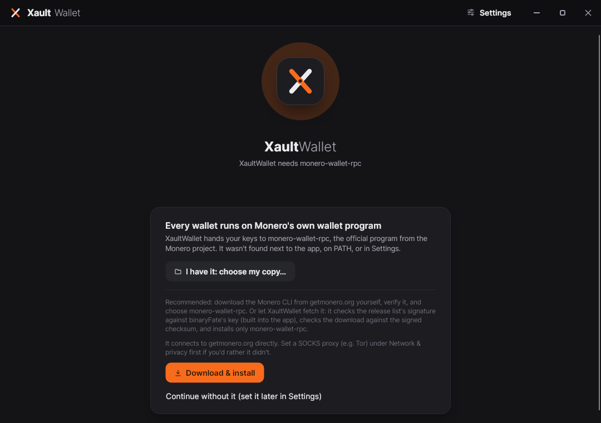
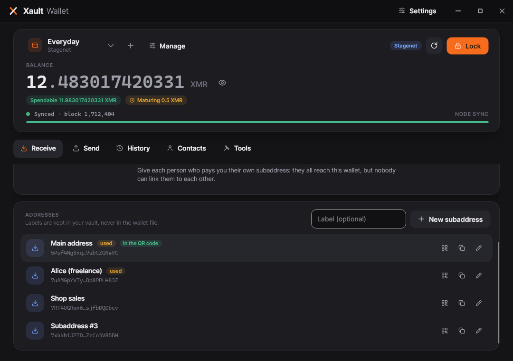
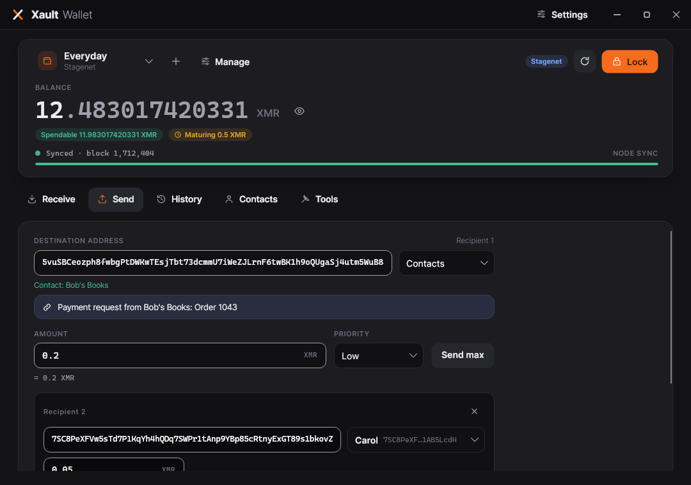
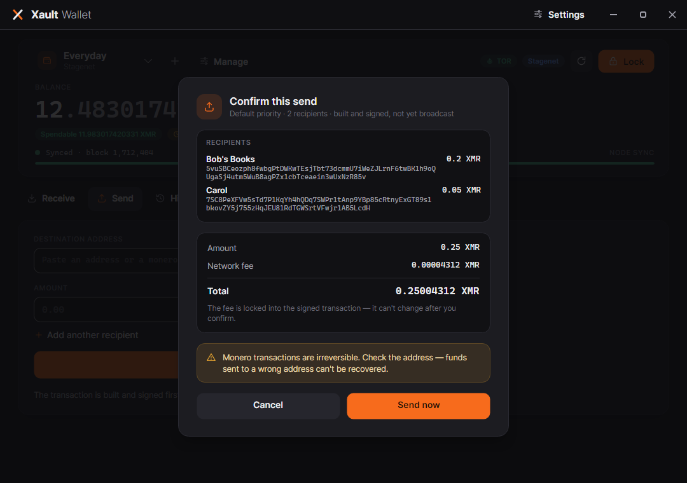
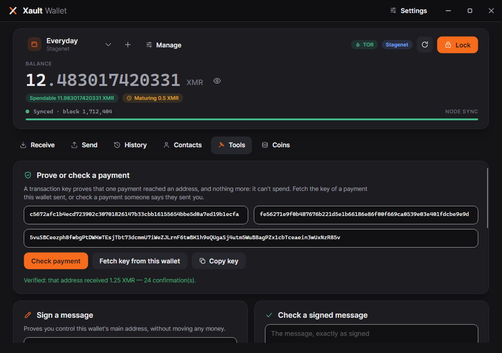
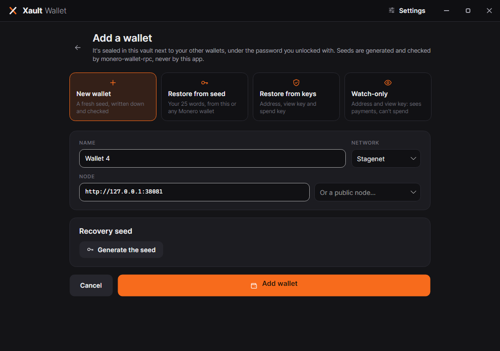
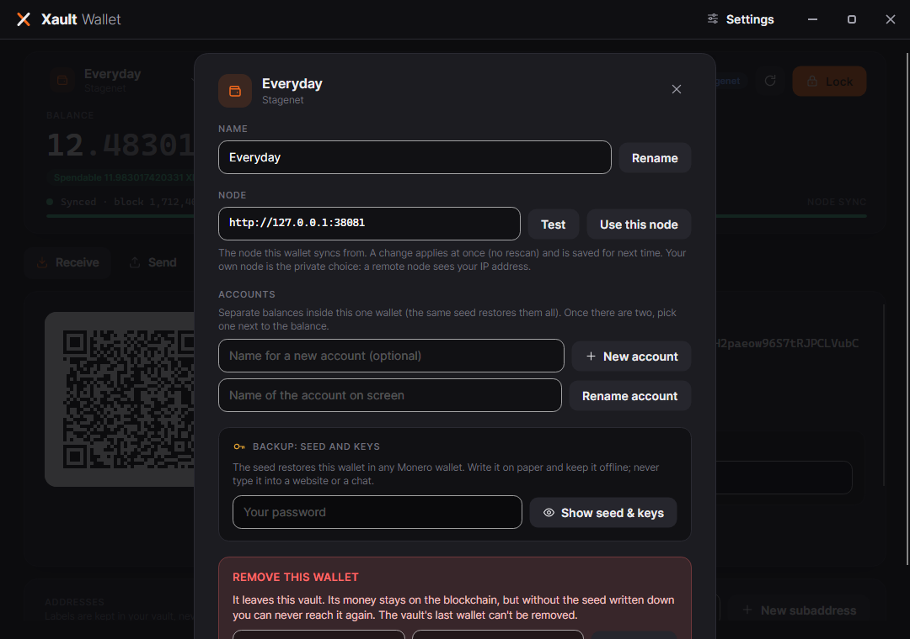
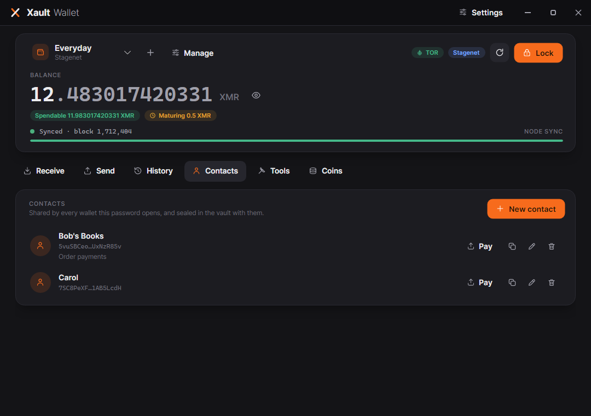
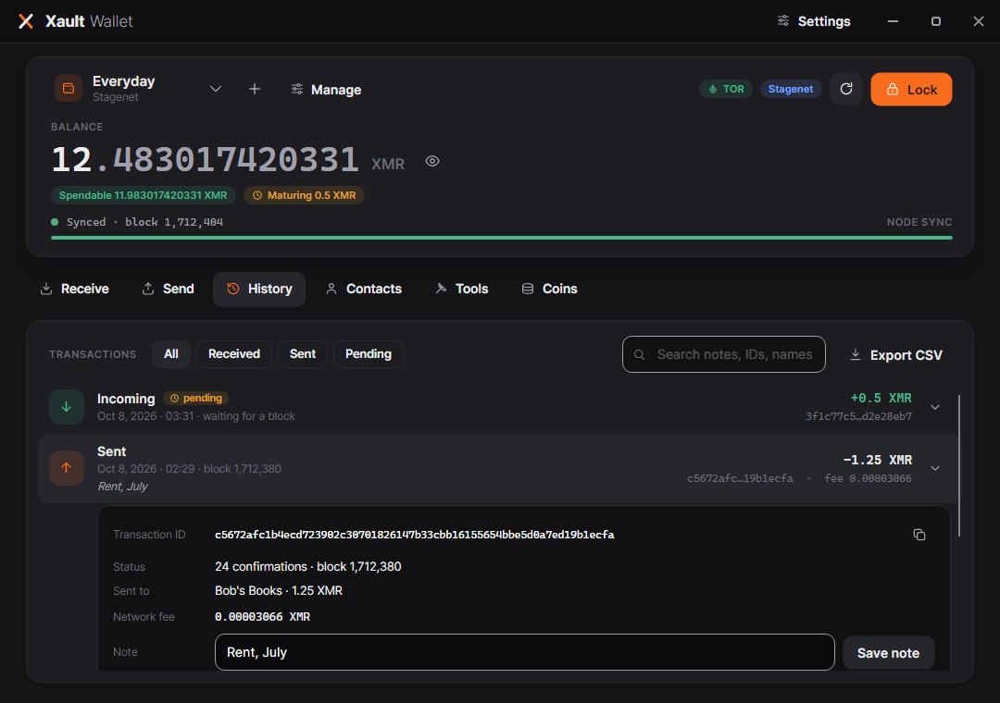
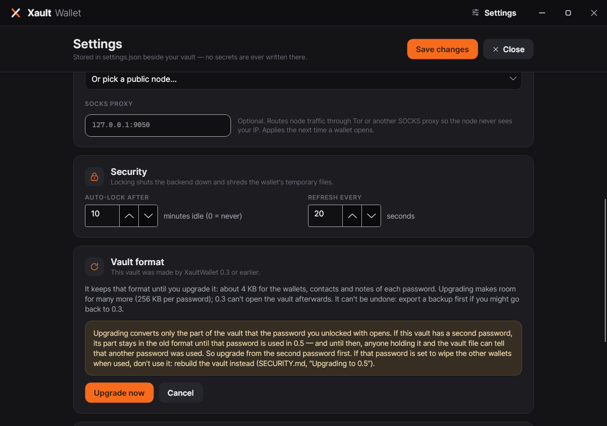

# XaultWallet

**A privacy-first desktop Monero (XMR) wallet with a duress password that opens a decoy wallet.**
Built on .NET 8 + Avalonia. Encrypted at rest with AES-256-GCM (Argon2id KDF). Drives the official
`monero-wallet-rpc` — it never reimplements Monero's cryptography.


<p align="center">
  
  
</p>

# Notification, Documentation assisted by Claude Code.


> ## ⚠️ Unaudited beta — do NOT use with real funds
>
> This is an **educational, work-in-progress** wallet. It has **not** had a professional security
> audit. It may contain bugs that cause **permanent, irreversible loss of funds** — Monero
> transactions cannot be reversed or refunded.
>
> - **Do not store real (mainnet) XMR in it.** Use **stagenet** (the default) or **testnet**.
> - Provided **as-is, with no warranty of any kind** (see [LICENSE](LICENSE)).
> - The **"wipe real wallet on duress"** option is irreversible and destroys your seed on that device.
> - Always keep an **independent offline backup** of your 25-word seed.
>
> Want a wallet for actual funds? Use an established, audited one (official Monero GUI/CLI,
> Feather, Cake). Read [SECURITY.md](SECURITY.md) in full before doing anything with this project.
>
> An internal code review & security audit (October 2026) found and fixed 20 issues, including two
> critical ones — see [docs/AUDIT-2026-10.md](docs/AUDIT-2026-10.md). That is not the independent
> professional audit this project still needs.

---

## Contents

- [Highlights](#highlights)
- [How it works (trust model)](#how-it-works-trust-model)
- [Quick start (~10 minutes)](#quick-start-10-minutes)
- [How-to guides](#how-to-guides)
- [What syncs from where (restore heights)](#what-syncs-from-where-restore-heights)
- [Where your data lives](#where-your-data-lives)
- [Security model in one page](#security-model-in-one-page)
- [Architecture](#architecture)
- [Build from source](#build-from-source)
- [Troubleshooting](#troubleshooting)
- [FAQ](#faq)
- [Roadmap](#roadmap)
- [Contributing, license, acknowledgements](#contributing-license-acknowledgements)

---

## Highlights

| | |
|---|---|
| 🔐 **Encrypted vault** | Your seeds are sealed with **AES-256-GCM**, key derived by **Argon2id** (256 MiB, 4 iterations). The only file that persists is `vault.xv`. |
| 👛 **Several wallets, one password** | Keep as many wallets as you like behind one password and switch between them from the top of the screen: new ones, restored from a seed or from keys, or **watch-only** (address + view key). Each runs its own backend and keeps syncing in the background. |
| 🎭 **Duress password** | A second password opens a **decoy profile** that looks completely normal. Both slots are equal-size whatever they hold (256 KiB each in 0.5's vault format) and position-randomised, and **their decrypted contents have exactly the same shape** — even someone holding the vault file *and* the duress password finds no marker of a second profile. Optional: using the decoy can **wipe** the real profile from the device. |
| 📇 **Contacts, labels, notes** | An address book, names for your subaddresses and accounts, and a note on any transaction — all sealed in the vault with the wallets (never in wallet files, which are shredded on lock). |
| 🧾 **Pay several people at once** | Up to 15 recipients in one transaction, one fee. Paste a `monero:` payment link and the form fills itself; ask for a payment with your own link and QR code (amount and description included). |
| 🧾 **Exact fee before you send** | The transaction is built and signed first (unbroadcast); the confirmation shows the **exact fee and total**. Confirm broadcasts that same signed transaction. |
| 🔢 **Amounts you can trust** | Typed amounts are parsed the same way on every system — `0,25` is 0.25 XMR everywhere, never 25 — and read back to you before anything is built. |
| 📷 **Receive with QR** | Your address as a QR code (`monero:` URI) next to the full address in a monospace face. CI decodes the rendered QR and checks it matches the address shown. |
| 🧭 **Address echo on import** | Importing a seed shows the **derived primary address** to confirm before anything is saved — catching a wrong seed-offset, typo, or network. |
| 🔑 **Proofs** | The **transaction key** of any payment you sent (safe to share — it cannot spend) and a check for anyone's payment; **signed messages** (prove you own an address) and **reserve proofs** (prove a balance) — make and check both. |
| ⬇️ **Verified one-click backend** | Bring your own `monero-wallet-rpc` (recommended), or press **Download & install**: the app checks getmonero.org's `hashes.txt` against **binaryFate's signature** (key pinned in the app) and the download against its signed SHA-256 before installing anything. |
| 🔒 **Locked-down backend** | wallet-rpc runs on loopback with **per-session random credentials**, its files (wallet, log, ring database) live in one folder **shredded on lock**, and the app checks the port belongs to the process it started before sending it anything. |
| 🧹 **Hygiene by default** | Copied addresses/keys **auto-clear from the clipboard after 30 s**. Logs **redact seeds, passwords and keys** and record nothing that tells your two wallets apart. Auto-lock on inactivity. |
| 🚫 **No hand-rolled crypto** | All key derivation, signing, proofs and address logic is done by the **official `monero-wallet-rpc`**. |

## How it works (trust model)

The most dangerous thing a wallet author can do is reimplement Monero's cryptography. XaultWallet
deliberately does not. It launches the **official `monero-wallet-rpc`** binary (which you download
from [getmonero.org](https://www.getmonero.org/downloads/) and verify yourself, or let the app fetch
and verify — see [Step 2](#step-2--get-monero-wallet-rpc)) as a **loopback-only,
password-protected child process** on a random local port, restores your wallet from seed into a
**private temporary folder**, and talks JSON-RPC to it. That child syncs against a `monerod` node —
yours, or a public one.

```
┌─────────────────┐  JSON-RPC (127.0.0.1, random port,   ┌────────────────────┐        ┌─────────┐
│   XaultWallet    │ ───── per-session digest auth) ─────▶│  monero-wallet-rpc  │ ─────▶ │ monerod │
│  (this project)  │                                       │  (official, yours)  │        │ (a node)│
└────────┬────────┘                                       └────────────────────┘        └─────────┘
         │ owns: encrypted vault (seed at rest), duress logic, UI
         │ never: keys, signing, address derivation — that's Monero's official code
```

XaultWallet's own code is responsible for exactly three things: the **encrypted vault format**, the
**duress/deniability logic**, and the **UI**.

## Quick start (~10 minutes)

**You need three things:** this release, the official Monero CLI tools, and a node to sync against.

### Step 1 — Get the release

Download the latest `XaultWallet-<version>-<platform>` archive from the releases page, check it
against `SHA256SUMS`, and extract it. It is one self-contained executable — **no .NET install
required** (Windows 10/11 x64, Linux x64, macOS Apple Silicon). Binaries are currently **unsigned**,
so Windows SmartScreen / macOS Gatekeeper will ask before the first run.

### Step 2 — Get monero-wallet-rpc

This wallet's whole trust model rests on that binary being genuine. Two ways:

- **Recommended — your own, verified by you.** Download the **Monero CLI** (not GUI) from
  <https://www.getmonero.org/downloads/>, verify it (import the signing key, check your archive's hash
  against the signed `hashes.txt`; details: [SETUP-MONERO-RPC.md](SETUP-MONERO-RPC.md)), extract it,
  and note the full path of **`monero-wallet-rpc`** — or put it on your PATH.
- **Convenient — let the app do it.** On first launch, if no `monero-wallet-rpc` is found, the startup
  screen offers **Download & install** (also in Settings → *Wallet backend*). It downloads the official
  CLI for your system from getmonero.org, checks `hashes.txt` against **binaryFate's signature** (his
  key ships inside XaultWallet, pinned by fingerprint) and the archive against its **signed SHA-256**,
  then installs only `monero-wallet-rpc` in your user profile. If any check fails, nothing is
  installed. What this trusts, exactly: [SECURITY.md](SECURITY.md#the-monero-wallet-rpc-installer).

<p align="center"></p>

### Step 3 — First launch & settings

1. Run XaultWallet. The splash checks for the binary and a node. Without a binary it stops and offers
   *Download & install* or *I have it: choose my copy…*; without a reachable node it offers
   **Continue anyway** (expected on a fresh machine).
2. To use your own copy: **Settings** (top-right) → **Wallet backend**: *Browse…* to
   `monero-wallet-rpc` (or leave it blank if it's on your PATH — the resolved path is shown) → **Test**.
   A typed path must be a full path; a bare `monero-wallet-rpc` is looked up on PATH, and relative
   paths are refused.
3. **Network & privacy**: pick a **stagenet** public node from the list (or your own `monerod
   --stagenet`) → **Test**. **Save changes**, then **Close**.

### Step 4 — Create a wallet on stagenet

Follow [How-to #1](#1-create-your-first-wallet). Stagenet coins are worthless by design — exactly
what you want while learning.

### Step 5 — Get stagenet coins and play

Grab coins from a community faucet (search "monero stagenet faucet"), then exercise the full loop:
receive, watch it confirm, send some back, lock, unlock. Walkthrough: [STAGENET-TESTING.md](STAGENET-TESTING.md).

---

## How-to guides

### 1) Create your first wallet


1. **Network & node** — keep **Stagenet**, enter a node or pick a preset.
2. **Recovery seed** — keep *Create a new wallet* and click **Generate my seed**. The seed is generated
   by `monero-wallet-rpc` itself. **Write the 25 words down, in order, on paper**, then either
   **verify** three of them or **save a backup file** (plaintext — store it offline).
3. **Vault password** — the meter refuses passwords that are trivially guessable (common words,
   sequences, repeats). A long passphrase of unrelated words is both strong and memorable.
4. (Optional) **Duress password** — see [How-to #3](#3-set-up-the-duress-decoy-password).
5. **Create vault**, unlock, and the wallet opens while it scans in the background.

A freshly generated wallet scans only from the moment it was created (minus a day's safety margin) —
there is nothing older to find, so its first sync is fast.

<br clear="right"/>

### 2) Import an existing wallet (with optional seed-offset passphrase)

1. Under **Recovery seed**, choose *Import an existing seed* and paste your 25 words.
2. **Seed offset passphrase** — leave **blank** unless the wallet was created elsewhere *with* one.
   It is case- and space-sensitive, a **separate secret** the 25 words cannot recover, and a wrong or
   missing offset silently opens a different, **empty** wallet.
3. **Scan from** — *Full history* (default, safest), *a specific block height* (your wallet's
   creation height if you know it; `3,150,000` and `3.150.000` both work), or *Now* (only for a
   brand-new seed with no history).
4. Set your password(s) and **Create vault**.
5. **Is this your wallet?** — XaultWallet opens the seed once and shows the **address it derives**.
   Compare it with the wallet you meant to import. If it doesn't match, go back and fix it — nothing
   is saved until you confirm.

### 3) Set up the duress (decoy) password

The duress password opens a second, fully functional wallet that looks identical in the app. Under
coercion you type the duress password instead of the real one.

1. On the create screen, switch on **Duress password**.
2. Choose a duress password (different from the main one; it should look like a real password).
3. Give the decoy a seed: **Generate a decoy** (fresh) or **Import a decoy seed** (one you control
   with a plausible small balance — an imported decoy always scans full history).
4. Save the decoy's backup too, and consider keeping a little XMR on it — an empty decoy is less convincing.
5. **Wipe the real wallet when the duress password is used** — read twice before ticking. Any use of
   the duress password (unlocking, changing its password or node) overwrites the real wallet's slot
   with random data **permanently, on that device**, and destroys vault copies kept by Settings →
   Restore. Only enable it if your real seed is backed up elsewhere, and never use the duress
   password yourself.

**Deniability, honestly stated:** the vault always contains two equal-size slots; without a duress
password the second slot is random filler, cryptographically indistinguishable from an encrypted
profile. Both slots' decrypted contents have the same fields — there is no "real"/"decoy" marker,
label, or password list anywhere. Each password's profile has its own wallets and contacts: the
decoy can hold several wallets too, and nothing in it mentions the other. Every action in the app
behaves the same for both. The limits — what an examiner *can* learn — are spelled out in
[SECURITY.md](SECURITY.md).

### 4) Receive and send

**Receive** — the Receive tab shows an address as text and as a QR code; **Copy address** puts it on
the clipboard (auto-clears after 30 s). **New subaddress** (with an optional label, e.g. "Alice")
gives a fresh, unlinkable address for the same wallet — good practice is a new one per payer. The
**Addresses** list shows them all with their labels, marks the ones that have been paid (*used*), and
shows any one's QR code. To **request a payment**, type an amount and what it's for: the QR code and
**Copy payment link** then carry a standard `monero:` link that wallets fill in for the payer.
Subaddresses you've handed out are remembered in the vault, so after a lock the next one is new.

<p align="center"></p>

**Send** —
1. Paste the destination address — or a `monero:` payment link, which fills in the amount and shows
   what it's for — or pick someone from **Contacts**, and type the amount. The line under the amount
   shows exactly how it was read (e.g. `= 0.25 XMR`). **Add another recipient** to pay several people
   in one transaction (up to 15, one fee). Pick a priority and click **Review & send**.
2. The transaction is **built and signed but not broadcast**. The confirmation shows every recipient
   (by contact name when it is one), the amount, **exact network fee** and **total** — locked into the
   signed transaction.
3. **Send now** broadcasts exactly that transaction. **Cancel** discards it; nothing touched the network.
4. After a send, the **payment proof** panel shows the txid and transaction key, and a new recipient
   can be saved as a contact in one click.

**Send max** sweeps the entire spendable balance through the same review → confirm flow.

If a broadcast fails or is interrupted, the message includes the txid and tells you to check History
before retrying — retrying a transaction that actually went through would pay **twice**.

<p align="center">
  
  
</p>

### 5) Prove a payment, sign a message, prove a balance (Tools)



To **prove** your payment, share the **transaction ID** and **transaction key** (shown after every
send; for an older one, open it in History and choose *Prove this payment*, or use *Fetch key from
this wallet* in Tools). The tx key proves that one payment and **cannot spend anything**. Never share
your seed or spend key. To **check** someone's payment, enter their txid, tx key and the address that
was paid: the wallet reports exactly how much that address received and how many confirmations it has.

Also in **Tools**:
- **Sign a message** with your main address (proves you control it, moves nothing), and **check**
  someone else's signed message.
- **Prove your balance** with a reserve proof — at least an amount, or the whole account — and check
  someone else's. Whoever checks it learns the total proven.
- **Re-check spent outputs**, if a misbehaving node left your balance wrong.

<br clear="right"/>

### 6) Several wallets: add, switch, manage

<p align="center">
  
  
</p>

- **Add** — the **+** next to the wallet's name: a **new wallet** (seed generated by
  `monero-wallet-rpc`, written down and checked like the first), **restore from seed**, **restore from
  keys** (address + private view and spend keys), or **watch-only** (address + private view key: sees
  incoming payments, can't spend, and can't see what was spent, so its balance reads as *received*).
  Before an import is saved, `monero-wallet-rpc` opens it — refusing keys that don't belong to the
  address — and you confirm the address it opens.
- **Switch** — pick a wallet from the list under its name. Each wallet you open keeps running (and
  syncing, once a minute) until you lock, so switching back is instant. The vault reopens on the
  wallet you used last. **Lock** locks them all.
- **Manage** — rename the wallet; change its **node** (applies at once, no rescan); create and name
  **accounts** (separate balances inside one wallet; pick one next to the balance); show its **seed and
  keys** (after your password); or **remove** it from the vault (your password and its name; the last
  wallet can't be removed — its money stays on the blockchain, reachable only with the seed).

### 7) Contacts, history, notes

<p align="center">
  
  
</p>

- **Contacts** — save the addresses you pay: Send shows who you're paying, History who you paid, and
  *Pay* fills the send form. Contacts belong to the password's profile: every wallet in it shares them.
- **History** — filter (received / sent / pending), search (notes, txids, names, amounts), and click a
  transaction for its details: confirmations, which of your addresses received it, where it went, the
  fee, and **a note** only you see (sealed in the vault). **Export CSV** includes the notes.

### 8) Change a password

Settings → **Vault password**. With a wallet open, it changes the password of the profile that's open —
only that one, whichever it is. From the unlock screen, it changes whichever profile the current
password opens. Your seeds don't change. It works the same for the main and the duress password (an
asymmetric rule would reveal which is which). A new password that would also open the *other* profile
is refused.

### 9) Coming from 0.3



Your vault opens in 0.5 as it is and keeps 0.3's format — about 4 KB per password, enough for a
wallet or two with some labels and contacts — until you upgrade it in Settings → **Vault format**
(256 KB per password, the size of every vault 0.5 creates). Before you start:

1. **Export a backup** (Settings → *Export backup*) if you might go back to 0.3. 0.3 can't open an
   upgraded vault, nor a password's part once 0.5 has saved it.
2. **If you have a duress password** (without wipe-on-duress), unlock with it first and wait until its
   wallet is ready; upgrade from there if you want the room. Then use your main password as usual.
   Until a password has been used in 0.5, someone holding it and the vault file could tell that the
   other one was — [Upgrading to 0.5](SECURITY.md#upgrading-to-05-vault-format-2) explains why, and
   what to do if wipe-on-duress is on.

<br clear="right"/>

---

## What syncs from where (restore heights)

| Seed | Scans from | Why |
|---|---|---|
| **Generated** (real or decoy) | The node's tip **just before the seed was created** (never more than the clock-based chain estimate), minus 720 blocks (~1 day) | A fresh seed cannot have earlier history; the margin absorbs a reorg or a node slightly ahead, and the cap stops a lying node from hiding incoming payments |
| **Imported real** | **Your choice**: full history (default) / a specific block / now (minus the same margin) | You know your wallet's age; full history is the safe default |
| **Imported decoy** (when creating the vault) | **Always full history** | A decoy that hides its own funds is a broken decoy |
| **Added later** (restored from seed or keys, watch-only) | **Your choice**: full history (default) or a specific block | The same rules as an import; a height above the chain tip is refused as a likely typo |

Only the seed (or keys) persist, so **every unlock re-scans from that height**. A wallet created recently
syncs in seconds; one restored from full history takes as long as the node needs every time. Switching
**network** on the create screen resets generated seeds and heights.

## Where your data lives

| Path | What | Secret? |
|---|---|---|
| `%APPDATA%\XaultWallet\vault.xv` (Linux: `~/.config/XaultWallet/`; macOS: `~/Library/Application Support/XaultWallet/`) | Your encrypted vault — the **only** persistent wallet data | Encrypted (AES-256-GCM, Argon2id) |
| `…\XaultWallet\settings.json` | Binary path, default node, refresh/auto-lock intervals, proxy | No secrets, plain JSON |
| `…\XaultWallet\logs\` | Diagnostic log | Seeds/passwords/keys redacted; nothing per-wallet (no heights, nodes or send events) |
| `%TEMP%\xaultwallet_*` (per open wallet) | wallet-rpc's restored wallet files, its log, its ring database | **Shredded** (overwritten + deleted) on lock/exit; private to your user |
| `%LOCALAPPDATA%\XaultWallet\monero-cli\` (Linux: `~/.local/share/XaultWallet/monero-cli/`) | `monero-wallet-rpc`, only if *Download & install* put it there | Not secret (an official, signature-checked binary) |

On Linux/macOS the `XaultWallet` folder is `0700` and its files `0600` regardless of your umask (older
installs are tightened at startup); exports and seed backups you save are written `0600` too.

**Privacy notes:** a public node's operator can see your IP and the transactions you broadcast (not
your balance or history) — and, with several wallets open, that the same computer is syncing all of
them. For privacy, run your own node or set a SOCKS proxy (Tor) in Settings.
Deleting `vault.xv` without a seed backup means the funds are gone — the seed *is* the wallet.

## Security model in one page

- **At rest:** seeds and keys sealed with AES-256-GCM; key derived by Argon2id (256 MiB / 4
  iterations). A wrong password is detected only by an authentication-tag failure — **no plaintext
  password comparison**.
- **Deniability:** two equal slots of 256 KiB each (whatever they hold; 4 KiB in a vault from 0.2/0.3
  until you upgrade it), order randomised, unused slot random. Both slots' plaintexts have the same
  fields; every operation is symmetric; a duress unlock takes the same time as a normal one. Limits
  (snapshots over time, a wipe flag examined before it fires, a vault from 0.3 used with only one of
  its passwords since, several wallets on one remote node): [SECURITY.md](SECURITY.md).
- **In memory:** passwords/keys pass through pinned, zero-on-dispose buffers — best-effort in a managed runtime.
- **On the wire:** wallet-rpc binds `127.0.0.1` on a random port, exists only while unlocked, and
  requires **per-session random digest credentials** (never on its command line). Before a seed is sent,
  the app checks the port belongs to the process it started (Linux, Windows). Browser-based attacks on
  the local RPC (cross-site requests, DNS rebinding) are refused.
- **Not protected against:** malware on your machine, an attacker with both your vault and your
  password, and coercion that doesn't stop at the decoy. No software fixes those.

## Architecture

```
XaultWallet.Core                ← class library, no UI deps, unit-tested
├── Security/
│   ├── VaultManager          create / unlock / open a session / change password / duress policy (all symmetric)
│   ├── VaultSession          an open profile: save its own slot with the unlock key, check / change its password
│   ├── VaultFile             on-disk format 2: magic XVLT, two equal 256 KiB slots, randomized order (keeps format 1 until upgraded)
│   ├── SlotPayload           the sealed JSON (v3: wallets + contacts, one field set for every slot; reads v1, v2)
│   ├── VaultCrypto           Argon2id (bounded params) + AES-256-GCM
│   ├── SecureBuffer          pinned, zeroed memory for secrets
│   ├── SecureDelete          best-effort overwrite-then-delete
│   └── PasswordStrength      conservative entropy estimate + pattern discounts
├── Models/                   WalletProfile, WalletSecrets (seed / keys / watch-only), Contact, SeedOffsetPolicy
├── Installer/                fetch + verify (binaryFate's OpenPGP signature, SHA-256) + install monero-wallet-rpc
└── Monero/
    ├── MoneroWalletService   generate / validate / open / accounts / subaddresses / multi-recipient send / relay / proofs
    ├── MoneroProcessManager  authenticated loopback wallet-rpc child; private session dir shredded on dispose
    ├── LoopbackPortOwnership "is that port really our child?" (Linux /proc, Windows GetExtendedTcpTable)
    ├── MoneroRpcClient       hand-built JSON-RPC envelope; digest-only credentials; no proxy
    ├── XmrAmount / BlockHeight  culture-independent parsing of what users type
    ├── MoneroAddress         sanity checks only (length/charset/prefix) — never checksum crypto
    ├── MoneroUri             monero: payment links (build, and parse strictly)
    ├── DaemonAddress         the one definition of a valid node URL
    └── SecretRedactor        structural redaction of secrets in RPC JSON

XaultWallet.Desktop             ← Avalonia 11, MVVM (CommunityToolkit.Mvvm)
├── Startup / Unlock / Create / Wallet / AddWallet / Settings views + view-models
├── Profile (the open vault: wallets, contacts, auto-lock) → one Wallet view-model per open wallet
├── Views/Wallet/             Receive, Send, History, Contacts, Tools tabs; the Manage sheet
├── Controls/                 Icon (line icons), QrCodeView (QRCoder)
└── The UI is IDENTICAL for the real and duress profiles — by construction

tests/   XaultWallet.Core.Tests        unit tests (vault, deniability, crypto, parsing, hardening)
         XaultWallet.IntegrationTests  real monero-wallet-rpc on a private regtest chain
tools/   TestRunner                    reflection test runner (fails on zero discovered tests)
         UiSnapshots                   renders every screen headlessly; fails on binding errors / QR mismatch
```

## Build from source

Requires the **.NET 8 SDK**.

```bash
./build.sh                                      # restore, build (warnings = errors), unit tests
dotnet run --project src/XaultWallet.Desktop    # run the app
```

- **Visual Studio 2022** (17.8+): open `XaultWallet.sln`, F5. Windows: `./build.ps1`.
- **Single-file release** for your platform: `./publish-windows.ps1` / `./publish-linux.sh`, or
  `dotnet publish src/XaultWallet.Desktop -c Release -r <win-x64|linux-x64|osx-arm64>`.
- **UI snapshots** (every screen, zero-binding-error check, QR round-trip with `zbarimg`):
  `dotnet run -c Release --project tools/UiSnapshots -- ui-snapshots`
- **Integration tests** against a real `monero-wallet-rpc` — a private regtest chain is the quickest:
  see [STAGENET-TESTING.md](STAGENET-TESTING.md#automated-integration-tests-regtest).
- **End-to-end tests** of the whole app through its UI (create, duress, receive, send, history, a
  second wallet, contacts, a two-recipient send), on Linux in process and on Windows against the
  released exe: see
  [STAGENET-TESTING.md](STAGENET-TESTING.md#end-to-end-tests-the-whole-app-through-its-ui).

CI (GitHub Actions) runs all of the above on every push: unit tests on Linux and Windows, the regtest
integration and end-to-end tests on Linux, the UI smoke test, and the Windows end-to-end test of the
published exe. A release is drafted only after that Windows test passes on the exact zip being
released; see [RELEASE.md](RELEASE.md#automated-releases-github-actions).

## Troubleshooting

| Symptom | Cause & fix |
|---|---|
| **"Couldn't start the wallet"** banner | XaultWallet can't find/launch `monero-wallet-rpc`. **Open Settings**, set the binary path (or *Download & install*), **Test**, then **Retry**. |
| **"Another program is answering on the wallet backend's port"** | Something else grabbed the random port before wallet-rpc could. Close other wallet software and **Retry** — a fresh port is chosen each time. |
| Stuck on **"Connecting to node…"** | The node is down, syncing, or on the wrong network. **Manage** → *Node*: *Test*, or switch this wallet to another node ([How-to #6](#6-several-wallets-add-switch-manage)). |
| **"The vault is full"** | One password's profile has to fit in 256 KiB: hundreds of wallets, contacts and notes do, but not without limit. Remove some (long notes first), then try again. Nothing was written. |
| **"This vault still has the format of XaultWallet 0.3…"** | That format holds about 4 KB per password. Settings → **Vault format** → *Upgrade* makes room; if you have a duress password, read [Coming from 0.3](#9-coming-from-03) first. Nothing was written. |
| **Watch-only balance looks too high** | A watch-only wallet sees what it receives but not what was spent (that needs the spend key). Its figure is labelled *received*. |
| **Imported wallet shows 0 balance** | Wrong **seed offset**, wrong **network**, or a too-recent **scan from** choice. Re-import with *Full history* and compare the derived address at the confirmation step. |
| **Balance says maturing** | Fresh coins need 10 confirmations (~20 min) to unlock; change and mining rewards too. |
| **Send fails: "Not enough spendable balance…"** | Amount + exact fee exceeds what's unlocked. Lower the amount or wait for funds to mature. |
| **Broadcast failed / interrupted** | The message shows the txid — check **History** (or an explorer) before retrying, so you don't pay twice. |
| **Forgot the vault password** | Unrecoverable by design. Restore from your 25-word seed into a fresh vault. |
| **Forgot a seed-offset passphrase** | Unrecoverable — the 25 words alone open a different wallet. Monero's design, not the app's. |
| Log files (`…/XaultWallet/logs`) | Safe to share when reporting bugs: no seeds, passwords, keys, nodes or per-wallet details. Still, skim before posting. |

## FAQ

**Why should I supply `monero-wallet-rpc` myself?**
Because you shouldn't have to trust a random wallet's bundled crypto binary. You download it from
getmonero.org, verify the signature yourself, and this app just drives it. If you'd rather not, the
built-in *Download & install* fetches the same official build and verifies it the same way (Monero's
release signature and checksum) before installing it; it never bundles one.

**Is the duress wallet detectable?**
Not from the vault file, and not from the decoy's own contents: the slots are equal-size, padded,
position-randomised, and decrypt to the same shape; the unused slot is random noise. That holds however
many wallets and contacts each password's profile has. What remains is
opsec (a bank statement showing 10 XMR bought while the decoy holds 0.1 is the giveaway) plus the
limits in [SECURITY.md](SECURITY.md) — notably copies of the vault taken at different times.

**Can I use this on mainnet?**
The UI allows it behind red warnings, but the honest answer is: **don't**. It's unaudited beta.

**Does the tx key let someone spend my funds?**
No. A transaction key proves one specific payment and nothing else. Never share the 25-word seed or
the spend key (or, for privacy, the view key).

## Roadmap

- Faster unlocks for old wallets (advance the stored restore height past spent history, or an opt-in
  encrypted wallet cache)
- Signed releases and reproducible builds
- Built-in Tor toggle with `.onion` node presets
- Key-image import for watch-only wallets (so they can see spends), and offline signing
- Hardware wallets (Ledger / Trezor through monero-wallet-rpc)
- Screen-capture protection while the seed is shown
- Opt-in fiat display (off by default — it would call a price API, which is a privacy trade-off)
- The big one: a **professional third-party security audit** before any mainnet story exists

## Contributing, license, acknowledgements

This is a personal, educational project shared in the open. Review, issues, and PRs are welcome —
extra eyes on a self-custody wallet are exactly the point of open-sourcing it. For anything
security-sensitive, use the private reporting process in [SECURITY.md](SECURITY.md) instead of a
public issue. Release notes: [CHANGELOG.md](CHANGELOG.md).

**License:** [MIT](LICENSE) — provided as-is, no warranty.

Built on the official Monero tools (`monerod`, `monero-wallet-rpc`) — this project drives them rather
than reimplementing Monero's cryptography. UI built with [Avalonia](https://avaloniaui.net/); QR codes
by [QRCoder](https://github.com/codebude/QRCoder). Screenshots are rendered from the app's real views
with demo data on stagenet. Brought to life in harmony — <https://dboudreau.dev>

XaultWallet is client-only: no service, no fee, no churning or mixing. It drives the official Monero
binary and nothing more.
